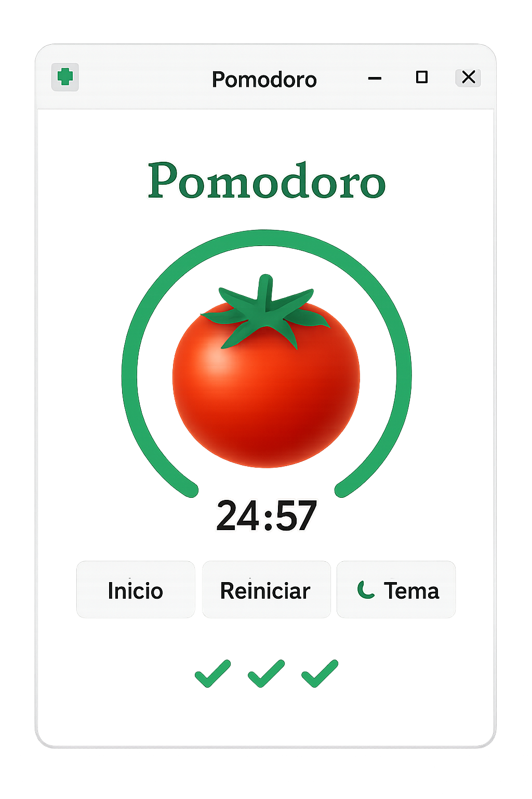

# Pomodoro-app 🕒🍅

**Pomodoro-app** es una aplicación de escritorio simple y funcional desarrollada en **Python** con **Tkinter**, que implementa la técnica Pomodoro para ayudarte a gestionar el tiempo y mejorar la productividad.

## 🧠 ¿Qué es la técnica Pomodoro?

Es una técnica de gestión del tiempo que divide tu trabajo en bloques de 25 minutos (Pomodoros) separados por pequeños descansos. Después de cuatro Pomodoros, se toma un descanso más largo. Esto ayuda a mantener la concentración y evitar la fatiga mental.

---

## 📸 Captura de Pantalla



---

## 🛠️ Tecnologías utilizadas

- Python 3
- Tkinter
- ttk para botones estilizados
- Iconos personalizados
- Imágenes en formato `.png`

---

## 🚀 Instalación

1. **Clona el repositorio:**

```bash
git clone git@github.com:sergiorioscomar/tkinter-pomodoro.git
cd pomodoro-app
```

2. **Instala Python si no lo tienes:**

```bash
sudo apt update
sudo apt install python3 python3-pip
```

3. **Instala las dependencias necesarias:**

```bash
pip install pillow
```

---

## 🚀 Uso

Ejecuta el archivo principal con:

```bash
python3 pomodoro-app.py
```

---

## 🎨 Características

- ✅ Temporizador de 25 minutos para enfoque.
- ☕ Pausas cortas y largas automáticas.
- 🎯 Interfaz clara con soporte para **modo claro y oscuro**.
- 🔁 Botones funcionales: Inicio, Reiniciar, Cambio de Tema.
- ⏳ **Barra de progreso** externa a la imagen del temporizador.
- 🧲 Imagen redonda de tomate como ícono visual del temporizador.
- 🪟 Ventana **fija y minimizable**.
- 🌟 Icono de aplicación personalizado incluido.

---

## ✨ Mejoras Futuras

- [ ] Notificaciones al terminar los ciclos.
- [ ] Sonido de alarma opcional.
- [ ] Estadísticas de productividad.
- [ ] Configuración de tiempos personalizados.

---

## 📁 Estructura del Proyecto

```
pomodoro-app/
├── img/
│   ├── tomato.png       # Imagen del tomate (temporizador)
│   └── icono.png        # Icono de la ventana
├── pomodoro_app.py      # Código principal de la app
└── README.md            # Documentación del proyecto

```
---
## 🧩 Características
- ✔️ Temporizador Pomodoro con 25/5/15 minutos predefinidos

- ✔️ Interfaz clara y minimalista

- ✔️ Modo claro y oscuro 🌞🌙

- ✔️ Barra de progreso circular exterior

- ✔️ Imagen redonda del tomate como fondo central

- ✔️ Botones mejorados con íconos y estilo moderno

- ✔️ Opción de pausa y reinicio dinámico en el mismo botón

- ✔️ Icono personalizado en la ventana

- ✔️ La ventana no es redimensionable y mantiene todo dentro del marco
---


## 🔧 Controles
- Inicio: comienza el ciclo de trabajo o descanso

- Pausar / Reiniciar: pausa el temporizador y cambia dinámicamente para reiniciar

- 🌗 Tema: cambia entre modo claro y oscuro

---

## 🤝 Contribuciones

¡Sos bienvenido a contribuir! Abrí un Issue o mandá un Pull Request si querés sumar algo nuevo 🚀

---

## 🗃️ Organización del proyecto

Este proyecto está gestionado con tableros Kanban en GitHub Projects para priorizar mejoras y bugs.

## 🧑‍💻 Autor

Desarrollado por Sergio Rios - 2025  
Inspirado por la técnica Pomodoro de Francesco Cirillo.

---

## 📜 Licencia

MIT License
