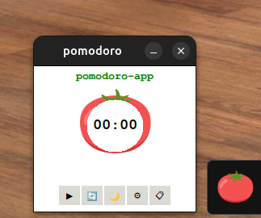
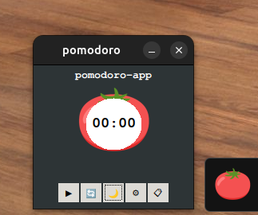
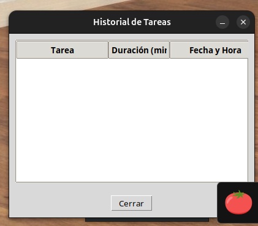

# Pomodoro-app 🕒🍅

**Pomodoro-app** es una aplicación de escritorio simple y funcional desarrollada en **Python** con **Tkinter**, que implementa la técnica Pomodoro para ayudarte a gestionar el tiempo y mejorar la productividad.

## 🧠 ¿Qué es la técnica Pomodoro?

Es una técnica de gestión del tiempo que divide tu trabajo en bloques de 25 minutos (Pomodoros) separados por pequeños descansos. Después de cuatro Pomodoros, se toma un descanso más largo. Esto ayuda a mantener la concentración y evitar la fatiga mental.

---

## 📸 Vistas de la Aplicación

### 🖥️ Interfaz Principal

*Interfaz principal en modo claro con temporizador y barra de progreso circular*


*Interfaz principal en modo oscuro con temporizador y barra de progreso circular*

### ⚙️ Configuración

*Panel de configuración para personalizar tiempos y tareas*

### 📋 Historial

*Vista del historial de tareas completadas con estadísticas*

---

## 🛠️ Tecnologías utilizadas

- Python 3
- Tkinter
- ttk para botones estilizados
- Iconos personalizados
- Imágenes en formato `.png`

---

## 🚀 Instalación

1. **Clona el repositorio:**

```bash
git clone git@github.com:sergiorioscomar/tkinter-pomodoro.git
cd pomodoro-app
```

2. **Instala Python si no lo tienes:**

```bash
sudo apt update
sudo apt install python3 python3-pip
```

3. **Instala las dependencias necesarias:**

```bash
pip install pillow
```

---

## 🚀 Uso

Ejecuta el archivo principal con:

```bash
python3 pomodoro-app.py
```

---

## 🎨 Características

- ✅ Temporizador Pomodoro con tiempos personalizables
- ✅ Configuración flexible de:
  - Tiempo de trabajo (por defecto 25 min)
  - Descanso corto (por defecto 5 min)
  - Descanso largo (por defecto 15 min)
  - Nombre de la tarea actual
- ✅ Historial de actividades que registra:
  - Tareas completadas
  - Duración de cada tarea
  - Fecha y hora de realización
- ✅ Base de datos SQLite para persistencia de datos
- ✅ Interfaz clara con soporte para **modo claro y oscuro**
- ✅ Botones funcionales:
  - ▶️ Inicio/Pausa
  - 🔄 Reinicio
  - 🌙 Cambio de Tema
  - ⚙️ Configuración
  - 📋 Historial de tareas
- ✅ **Barra de progreso** circular
- ✅ Imagen de tomate como ícono visual
- ✅ Ventana **fija y minimizable**
- ✅ Icono de aplicación personalizado
- ✅ Alarma sonora al completar cada ciclo

---

## 🧩 Características Detalladas

- ✔️ Temporizador Pomodoro con tiempos personalizables
- ✔️ Sistema de configuración completo:
  - Ajuste de tiempos de trabajo y descanso
  - Personalización del nombre de la tarea
  - Persistencia de configuraciones
- ✔️ Historial detallado de actividades:
  - Registro de tareas completadas
  - Seguimiento de tiempo por tarea
  - Historial temporal de actividades
- ✔️ Interfaz clara y minimalista
- ✔️ Modo claro y oscuro 🌞🌙
- ✔️ Barra de progreso circular exterior
- ✔️ Imagen redonda del tomate como fondo central
- ✔️ Botones mejorados con íconos y estilo moderno
- ✔️ Opción de pausa y reinicio dinámico
- ✔️ Icono personalizado en la ventana
- ✔️ Ventana no redimensionable
- ✔️ Base de datos para guardar configuraciones e historial
- ✔️ Alarma sonora al completar ciclos

---

## 🔧 Controles

- ▶️ Inicio/Pausa: comienza o pausa el ciclo actual
- 🔄 Reinicio: reinicia el temporizador
- 🌙 Tema: cambia entre modo claro y oscuro
- ⚙️ Configuración: ajusta tiempos y nombre de tarea
- 📋 Historial: muestra registro de tareas completadas

---

## ✨ Mejoras Futuras

- [ ] Notificaciones del sistema al terminar los ciclos
- [ ] Sonido de alarma personalizable
- [ ] Estadísticas detalladas de productividad diaria/semanal
- [ ] Exportar historial a CSV/Excel
- [ ] Sincronización entre dispositivos
- [ ] Recordatorios programados

---

## 📁 Estructura del Proyecto

```
pomodoro-app/
├── img/
│   ├── tomato.png       # Imagen del tomate (temporizador)
│   └── icono.png        # Icono de la ventana
├── pomodoro_app.py      # Código principal de la app
└── README.md            # Documentación del proyecto

```
---
## 🧩 Características
- ✔️ Temporizador Pomodoro con 25/5/15 minutos predefinidos

- ✔️ Interfaz clara y minimalista

- ✔️ Modo claro y oscuro 🌞🌙

- ✔️ Barra de progreso circular exterior

- ✔️ Imagen redonda del tomate como fondo central

- ✔️ Botones mejorados con íconos y estilo moderno

- ✔️ Opción de pausa y reinicio dinámico en el mismo botón

- ✔️ Icono personalizado en la ventana

- ✔️ La ventana no es redimensionable y mantiene todo dentro del marco
---


## 🔧 Controles
- Inicio: comienza el ciclo de trabajo o descanso

- Pausar / Reiniciar: pausa el temporizador y cambia dinámicamente para reiniciar

- 🌗 Tema: cambia entre modo claro y oscuro

---

## 🤝 Contribuciones

¡Sos bienvenido a contribuir! Abrí un Issue o mandá un Pull Request si querés sumar algo nuevo 🚀

---

## 🗃️ Organización del proyecto

Este proyecto está gestionado con tableros Kanban en GitHub Projects para priorizar mejoras y bugs.

## 🧑‍💻 Autor

Desarrollado por Sergio Rios - 2025  
Inspirado por la técnica Pomodoro de Francesco Cirillo.

---

## 📜 Licencia

MIT License
